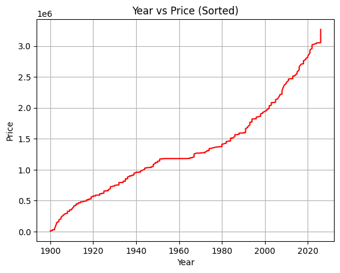
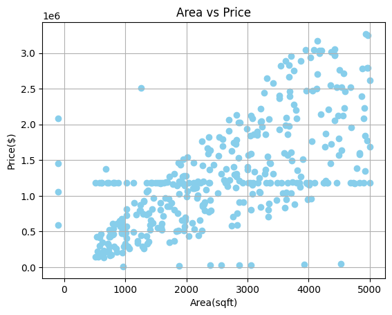
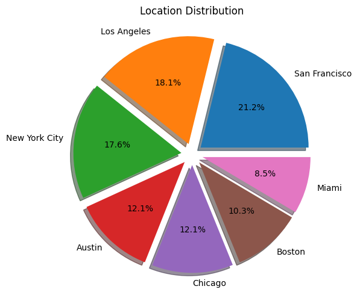

# housing-data-cleaning.ipynb 

# 🏠 Clean a Messy Housing Dataset Using Pandas & Visualize Distributions

## 📖 Description
This project demonstrates how to **clean and preprocess a messy housing dataset from Kaggle** using **Pandas** and visualize it using **Matplotlib**.  

The raw dataset contains missing values, duplicates, inconsistent column names, irregular text formatting, and outliers. The main goal is to transform the dataset into a **clean, analysis-ready form** for exploratory data analysis (EDA) or machine learning applications.

---

## 🎯 Goals / Objectives
- Load and inspect the messy housing dataset  
- Standardize column names and correct data types  
- Handle missing numerical and categorical values  
- Remove duplicate rows  
- Normalize inconsistent location names (e.g., NYC → New York City, LA → Los Angeles)  
- Detect and remove outliers using the **IQR method**  
- Visualize numerical and categorical distributions with boxplots, histograms, and pie charts  

---

## ✨ Features
- Column standardization and renaming (`Price` → `Price($)`, `Year_built` → `Year_built(AD)`)  
- Duplicate row detection and removal  
- Missing value handling:  
  - Numerical → median  
  - Categorical → mode  
- Data type conversion for numerical columns  
- Text normalization for location names  
- Outlier detection and removal using **IQR**  
- Visualizations: boxplots, histograms, and pie chart for location distribution  

---

## 🛠️ Technologies / Tools
- **Python 3**  
- **Pandas** – data cleaning and manipulation  
- **Matplotlib** – data visualization  

---

## 📂 Dataset / Resources
- **Source:** Kaggle (Messy Housing Dataset)  
- **Format:** CSV  
- **Columns:** `Area_sqft`, `Bedrooms`, `Bathrooms`, `Year_built(AD)`, `Price($)`, `Location`  
- The dataset contains duplicates, missing values, inconsistent city names, and outliers  

---

## ▶️ How to Run / Usage
1. Clone the repository:  
git clone https://github.com/sushil0126/housing-data-cleaning.ipynb.git 
2. Navigate to the project folder:
cd clean-messy-housing-data 
 
---

## 📊 Example Outputs & Insights
After cleaning and preprocessing, the project produces visual insights including:

- Boxplots for **Area (sqft), Bedrooms, Bathrooms, Year Built, and Price($)** 
  
- Histograms showing the **frequency distribution** of numerical features 
   
- Pie chart depicting **property distribution by location**
  

These visualizations help in understanding the spread, skewness, and concentration of data across cities and numerical features.

---

## 🎓 Learning Outcomes
By completing this project, you will:

- Gain hands-on experience cleaning messy, real-world datasets  
- Learn how to handle missing values and duplicates efficiently  
- Standardize and normalize categorical values for consistency  
- Detect and remove outliers using statistical methods  
- Visualize data distributions using boxplots, histograms, and pie charts  
- Prepare a dataset for further analysis or machine learning tasks  

This project strengthens skills in **Python, Pandas, Matplotlib, and EDA**, and provides a strong foundation for tackling real-world datasets.
